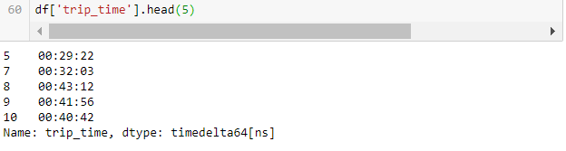
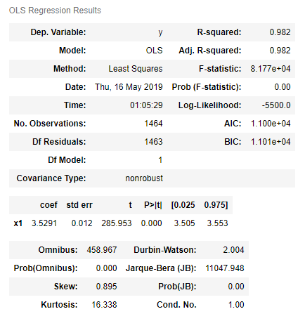

# Analysis of NYC Green Taxi Data
---
### Authors: 
- **Chase Murray(PhD) (Assistant Professor: University at Buffalo)** [**(cmurray3@buffalo.edu)**](cmurray3@buffalo.edu)
- **Aditya Maunakbhai Patel (Student: University at Buffalo)** [**(apatel-36@buffalo.edu)**](apatel36@buffalo.edu)
- **Forum Dharamshi Bhutaiya (Student: University at Buffalo)** [**(forumdha@buffalo.edu)**](forumdha@buffalo.edu)

### YouTube Video: [(**Link**)](https://youtu.be/f3k-uR91DLc)
---

## Introduction
- For this project, we have used **NYC green taxi data**. This data is available in ***JSON*** [(***What is JSON?***)](https://www.json.org/) format.
- Green taxi data is available for year 2009 and year 2014 to 2018. Which is taken from this [**Link**](https://data.cityofnewyork.us/browse?q=green+taxi).
- The data dictionary can be viewed or downloaded from this [**Link**](https://www1.nyc.gov/assets/tlc/downloads/pdf/data_dictionary_trip_records_green.pdf). 
- This project is divided into **three** parts.
	-	Taxi data analysis of different years 
	-	Time series analysis
	-	Applying machine learning models
- **Taxi data analysis of different years:**		
	-	 To know the change in number of short distance trips and long distance trips for different years.
	-	 To know the change in total number of trips over the year.
	-	 To check if there is a change in average fare amount for trip distance between 0 to 10 over the years.
	-	 To know the revenue for each year.
	-	 To know the type of payment method people use over the year. Further we can know if they tend to use different payment method in the past compare to present. 
- **Time series analysis:**
	-	To know in which months people use taxi more. 
	-	To know if weather conditions has any relation with people using taxi.
	-	To know if there is any difference in fare amount for each days of the week. 
	-	To know the time stamps of each pickups and drop-offs for short distance trips and long distance trips. Further we can know if there is any particular time range in which people tend to use taxi more. 
	-	To know the number of passengers for short distance trips and long distance trips. 
- **Applying machine learning models:**
	-	For this part of the project, we've used different machine learning models such as OLS [**(What is OLS?)**](https://en.wikipedia.org/wiki/Ordinary_least_squares), Linear Regression [**(What is Linear Regression?)**](https://en.wikipedia.org/wiki/Linear_regression), Multiple Linear Regression [**(What is Multiple Linear Regression?)**](https://www.investopedia.com/terms/m/mlr.asp), Ridge Regression [**(What is Ridge Regression?)**](https://ncss-wpengine.netdna-ssl.com/wp-content/themes/ncss/pdf/Procedures/NCSS/Ridge_Regression.pdf), Lasso [**(What is Lasso?)**](https://en.wikipedia.org/wiki/Lasso_(statistics)). 
	-	Data has been divided into train data set and test data set. And after building the model, model has been evaluated on the test data set.
	-	Best model has been chosen by considering **Root Mean Square Error (RMSE)** value [**(What is RMSE?)**](http://statweb.stanford.edu/~susan/courses/s60/split/node60.html).
- **Further we have used ```matplotlib``` and ```seaborn``` to show graphical represesntation of above analysis**.

---

## Requirements
- There is no requirement of having a unique API key for this data set.
- However to run the given code, you may need to import/download different packages which are listed below. Mostly all these packages are pre-installed in Anaconda. But in rare case, you may need to download few of these packages. To do so, refer to the link given. After going to link, copy the **```pip install```** command for respective package and simply run it thorough anaconda prompt. 
- For example, If we want to download **pandas**, this is the command(**```pip install pandas```**) we get from the link listed below. To download the package, simply write this command in **Anaconda Prompt** and required package will be installed. 

 

	-	json
	-	urllib
	-	pandas [**(Link)**](https://pypi.org/project/pandas/)
	-	numpy [**(Link)**](https://pypi.org/project/numpy/)
	-	matplotlib.pyplot [**(Link)**](https://pypi.org/project/matplotlib/)
	-	seaborn [**(Link)**](https://pypi.org/project/seaborn/)
	-	statistics [**(Link)**](https://pypi.org/project/statistics/)
	-	sklearn [**(Link)**](https://pypi.org/project/scikit-learn/)
	-	math
	-	datetime [**(Link)**](https://pypi.org/project/DateTime/)
	-	statsmodels.api [**(Link)**](https://pypi.org/project/statsmodels/)
	-	random [**(Link)**](https://pypi.org/project/random2/)
	
---

## Explanation of the code and results obtained
## Part1: Taxi data analysis of different years

Before getting started, we need to import few packages.

	#Importing required packages
	import json
	import urllib
	import pandas as pd
	import numpy as np
	import matplotlib.pyplot as plt
	import seaborn as sb
	import statistics

Further, we can begin to load required [**data**](https://data.cityofnewyork.us/browse?q=green+taxi) for each years. 

	#getting data for year 2018
	url1 = 'https://data.cityofnewyork.us/resource/w7fs-fd9i.json?$limit=50000'
	
	#converting to pandas dataframe
	df1 = pd.read_json(url1, orient = 'columns')
	
	#converting to datetime format
	df1['lpep_dropoff_datetime'] = pd.to_datetime(df1['lpep_dropoff_datetime'])
	df1['lpep_pickup_datetime'] = pd.to_datetime(df1['lpep_pickup_datetime'])

	df1['trip_time'] = df1['lpep_dropoff_datetime'] - df1['lpep_pickup_datetime'] #HH:MM:SS
	df1['diff_time']=df1['trip_time']/np.timedelta64(1,'m') #output in minutes
	df1 #checking the data

Here, **url1** is the data for year 2018. By using ```$limit=50000``` we have taken 50,000 data for year 2018. Further this data is converted into pandas dataframe using ```pd.read_json``` and which has been named as ```df1```. 

```trip_time``` is the new column created which has the trip duration information in **HH:MM:SS** format. Further we can convert this information in **minutes only** using this code ```df1['trip_time']/np.timedelta64(1,'m')```. Which is inserted in the dataframe as column name ```diff_time```.

Further we can get the data for the year 2017[(**data**)](https://data.cityofnewyork.us/resource/5gj9-2kzx.json?$limit=50000), 2016[(**data**)](https://data.cityofnewyork.us/resource/pqfs-mqru.json?$limit=50000), 2015 [(**data**)](https://data.cityofnewyork.us/resource/utt9-dvgj.json?$limit=50000), 2014 [(**data**)](https://data.cityofnewyork.us/resource/2np7-5jsg.json?$limit=50000), 2009 [(**data**)](https://data.cityofnewyork.us/resource/f9tw-8p66.json?$limit=50000) as shown above by providing different data. Further we can save the dataframe as ```df2```, ```df3```, ```df4```, ```df5```, ```df6``` respectively.

## ***Analysis for different range of trips***
	#for year 2018
	df1_1 =  df1[(df1['trip_distance']<1)]
	df1_12 = df1[(df1['trip_distance']>=1) & (df1['trip_distance']<2)]
	df1_23 = df1[(df1['trip_distance']>=2) & (df1['trip_distance']<3)]
	df1_34 = df1[(df1['trip_distance']>=3) & (df1['trip_distance']<4)]
	df1_45 = df1[(df1['trip_distance']>=4) & (df1['trip_distance']<5)]
	df1_56 = df1[(df1['trip_distance']>=5) & (df1['trip_distance']<6)]
	df1_6 = df1[(df1['trip_distance']>=6)]
 This part contains basic filtering of the data as per requirement. **```df1_1```** represents data in which **```trip_distance```** is less than 1 mile. **```df1_12```** represents data in which **```trip_distance```** is between 1 to 2 miles. **```df1_23```** represents data in which **```trip_distance```** is between 2 to 3 miles. **```df1_34```** represents data in which **```trip_distance```** is between 3 to 4 miles. **```df1_45```** represents data in which **```trip_distance```** is between 4 to 5 miles. **```df1_56```** represents data in which **```trip_distance```** is between 5 to 6 miles. **```df1_6```** represents data in which **```trip_distance```** is more than 6 miles. 

Further we can do the same for year 2017, 2016, 2015, 2014 and 2009.
After doing such process, we can get **```d18```**, **```d17```**,**```d16```**,**```d15```**,**```d14```**,**```d09```** for year 2018,2017, 2016, 2015, 2014 and 2009 respectively.

For example, **```d18```** is the ***list*** which contains information of the length of the different range of the trips we calculted above for year 2018.  
	
	d18 = [len(df1_12),len(df1_23),len(df1_34),len(df1_45),len(df1_56),len(df1_6)]
	d17 = [len(df2_12),len(df2_23),len(df2_34),len(df2_45),len(df2_56),len(df2_6)]
	d16 = [len(df3_12),len(df3_23),len(df3_34),len(df3_45),len(df3_56),len(df3_6)]
	d15 = [len(df4_12),len(df4_23),len(df4_34),len(df4_45),len(df4_56),len(df4_6)]
	d14 = [len(df5_12),len(df5_23),len(df5_34),len(df5_45),len(df5_56),len(df5_6)]
	d09 = [len(df6_12),len(df6_23),len(df6_34),len(df6_45),len(df6_56),len(df6_6)]

We can plot the ***bar chart*** using the code shown for the data filtered above to see the graphical representation. 

	with plt.style.context ('grayscale'):
	    n_groups = 6
	    fig, ax = plt.subplots()
	    index = np.arange(n_groups)
	    bar_width = 0.2
	    opacity = 0.8
	    reacts1 = plt.bar(index, d09, bar_width,alpha=opacity,color='#276478',label='2009')
	    reacts2 = plt.bar(index+bar_width, d15, bar_width,alpha=opacity,color='#849FAD',label='2015')
	    reacts4 = plt.bar(index+(bar_width)*2, d16, bar_width,alpha=opacity,color='#708B6E',label='2016')
	    plt.xlabel('Year')
	    plt.ylabel('Number of trips')
	    plt.title('Change in number of total trips in different range')
	    plt.xticks(index + bar_width, ('<2 miles', '2-3 miles', '3-4 miles', '4-5miles','5-6 miles','>6 miles'))
	    plt.legend()
Which gives the output as below.

Here, **```n_groups```** are the number of x-ticks we have. We can adjust **``bar_width``** as per requirement. In this graph we have three reacts(year 2009, 2015 and 2016). Hence create each bars using **```reacts1```**,**```reacts2```**,**```reacts3```**. Here it is **important** to know that we have to increase the by default index or else the bars will overlap. This can be done by adding **```bar_width```** in the each reacts. Further, **```plt.xlabel```** and **```plt.ylalel```** are used to add labels on each axis. **```plt.legend```** is used to differenciate each year in graph. **```plt.title```** is used to add title in year. **```plt.xticks```** is used to replace x-ticks with the desired names.
 


From the figure, we can conclude that the less than 2 miles trips has been decreased over the years and more than 3 miles trips has been increased over the years. 


## ***Analysis of change in total number of trips over the years***

In this part, to know the change in total number of trips, query has been made by using ```mta_tax``` = 0 and ```trip_type``` = 1 for each year. Code for getting the data for year 2018 is shown below.

	#for year 2018
	url1 = 'https://data.cityofnewyork.us/resource/w7fs-fd9i.json?$where=mta_tax=0&trip_type=1&$limit=30000'
	dataf1 = pd.read_json(url1, orient = 'columns')
	dataf1= dataf1.dropna()
	len18 = len(dataf1)
	#len18

Here, ```drona()``` is used to remove all the NA values from the data. This data is saved as ```dataf1```. ```len18``` represents the length of ```dataf1```. We can do the same for year 2017, 2016, 2015, 2014. And this data is saved as ```len17```, ```len16```, ```len15```, ```len14``` respectively.

Further, this analysis is used to show the results graphically using ```matplotlib``` using code below.

	#bar chart
	total_trips [len14,len15,len16,len17,len18]
	trips = np.arange(len(total_trips))
	#total_trips
	lab = ['2014','2015','2016','2017','2018']
	
	with plt.style.context ('grayscale'):
	    plt.bar(trips, total_trips, align='center', alpha=1,color = '#276478') #to plot bar chart
	    plt.xticks(trips,lab) #to replace year in place of x axis
	    plt.title('Bar chart of number of taxi trips over the years 2014 to 2018') #to show title
	    for index,data in enumerate(total_trips):
	        plt.text(x=index-0.35 , y =1.15 , s=f"{data}" , fontdict=dict(fontsize=15),color = 'white')
	
Here,

	for index,data in enumerate(total_trips):
	        plt.text(x=index-0.35 , y =1.15 , s=f"{data}" , fontdict=dict(fontsize=15),color = 'white')
is used to show Y axis value at the bottom of the each bar.
At the end, we get the output shown below.


From the figure we can say that, trend of people using green taxi over the years has been decreased. People use less green taxi compared to past. *Maybe* we can say that people now days prefer to use Uber or lyft in place of using green taxi as they are more convenient and easier to order.


## ***Analysis of average fare amount when trip distance is less than 10***
For this part, data has been filter for trip distance less than 10 miles.

For example:
for year 2009, data has been filtered using this code shown below. Explanation of each line is provided using '#'. 

	#year 2009
	dfr2009 = 'https://data.cityofnewyork.us/resource/f9tw-8p66.json'  #getting the data
	dfr2009 = pd.read_json(dfr2009, orient = 'columns')

	dfr2009= dfr2009[['fare_amount','total_amount','trip_distance']]  #taking only fare_amount, total_amount, trip_distance into account
 
	dfr2009.dropna()   #droping NA values

	len2009 = len(dfr2009)   #length of the dataframe

	dfr2009 = dfr2009[['total_amount']][(dfr2009['trip_distance']<10)]  #filtering for trip_distance less than 10

	avg2009 = dfr2009['total_amount'].sum()/len2009   #taking average

	avg2009 #9.215490000000013

Here, filtered data for year 2009 is saved as **```avg2009```** . We can do the same for year 2015 and 2014. After doing further filtration for each year, data has been saved as **```avg2015```** , **```avg2014```** respectively.

Graphical representation of the filtered data is shown using code below. 

	#line chart and bar chart for change in fare amount
	ticks = ['2009','2014','2015']

	fare_amount = [avg2009,avg2014,avg2015]

	with plt.style.context ('grayscale'):
	    fig , (ax1 , ax2) = plt. subplots (2, sharey = False,figsize=(5,10) )
	    ax2 = sb.lineplot(x=ticks, y=fare_amount,color = '#276478' , marker = 'o')
	    ax1.bar(ticks, fare_amount, align='center', alpha=1,color = '#276478')
	    ax1.set(title = 'Bar Chart')
	    ax2.set(title = 'Line Chart')
	    ax1.set(xlabel = 'Year', ylabel ='Average fare amount')
	    ax2.set(xlabel = 'Year', ylabel ='Average fare amount')
	    for index,data in enumerate(fare_amount):
	        plt.text(x=index , y =data+0.4 , s=f"{data}" , fontdict=dict(fontsize=15),color = 'red')

Here, **```plt.subplots```** is used to create two plots. On **```ax2```** we have plotted lineplot using seaborn and on **```ax1```** we have plotted bar chart using matplotlib. By using **```ax1.set(title = 'Bar Chart')```**  and **```ax2.set(title = 'Line Chart')```** we can write a title  on each plot. Further x label and y label for each plot can be written using **```ax1.set(xlabel = 'Year', ylabel ='Average fare amount')```** , **```ax2.set(xlabel = 'Year', ylabel ='Average fare amount')```** for **```ax1```** and **```ax2```** respectively.

Output is shown below.


From the output above, we can conclude that average fare amount has been increased over the years. 

#### Now the question is about revenue. We have seen that the total number of trips has been decreased over the years and average fare amount has been increased. It would be interesting to check the revenue for each years. 

## ***Checking the revenue over the years***

In this part, **```300000```** data has been taken for each years. Hence for year 2018, query has been made using the code below. And further this data obtained is saved as **```dfr1```** in form of pandas dataframe. 

	urlr1 = 'https://data.cityofnewyork.us/resource/w7fs-fd9i.json?$limit=300000'
	dfr1 = pd.read_json(urlr1, orient = 'columns')

Further, for the year 2017, 2016, 2015, 2014 filtration is done and data is saved as **```dfr2```** , **```dfr3```** . **```dfr4```** ,**```dfr5```** respectively.

Further, we can get the sum of **```fare_amount```** for each year using the code shown below. 

	#checking the total revenue for each year
	rev14 = dfr4['fare_amount'].sum() #year2014
	rev15 = dfr5['fare_amount'].sum() #year2015
	rev16 = dfr3['fare_amount'].sum() #year2016
	rev17 = dfr2['fare_amount'].sum() #year2017
	rev18 = dfr1['fare_amount'].sum() #year2018

**```rev14```**, **```rev15```**, **```rev16```**, **```rev17```**, **```rev18```** is the revenue for years 2018,2017,2016,2015,2014 respectively. 
Further we can plot this revenue in form of bar chart using code shown below. 

	#ploting bar chart for revenue
	revenue = [rev14,rev15,rev16,rev17,rev18]
	y_pos = np.arange(len(revenue))
	lab = ['2014','2015','2016','2017','2018']

	with plt.style.context ('grayscale'):
	    plt.bar(y_pos, revenue, align='center', alpha=1,color = '#276478')
	    plt.xticks(y_pos,lab)
	    plt.title('Bar chart of total revenue over the years from 2009 to 2018')
	    plt.ylabel('Total Revenue($)')
	    plt.xlabel('Year')
	    for index,data in enumerate([int(n/100000) for n in revenue]):
	        plt.text(x=index-0.12 , y =1 , s=f"{data}" , fontdict=dict(fontsize=15),color = 'white')

Which gives output as below. 


***Digits at the bottom of each bar are scaled. Because original values were overlapping.*** 

From the bar chart and the number shown below, we can say chat there is not much change in revenue over the years. Revenue is between 3,300,000 to 3,700,000. *But* from the graph, we can say that there was a sudden decrease in revenue for year 2017.


## ***Comparison of type of payment used over the years***
 
In this part, we wanted to see what is the payment type people use over the years. And further to know if there is any change in people using payment methods or not.

From the ***data dictionary***, we can see that 

	Payment type 1= Credit card
	Payment type 2= Cash
	Payment type 3= No charge
	Payment type 4= Dispute
	Payment type 5= Unknown
	Payment type 6= Voided trip 

In this part, we'll only take payment type 1 and payment type 2 into account. 

Further, data has been filtered as per requirement. 

Code for year 2009 is shown below. 

	#for year 2009
	len(dfr6) 
	
	dfr6['payment_type'][dfr6['payment_type'] == 'CASH'] = 'Cash'
	
	payment109 = dfr6[(dfr6['payment_type']=='Credit')]
	len(payment109)
	
	payment209 = dfr6[dfr6['payment_type']=='Cash']
	payment209
	len(payment209)

Data from previous part(***revenue***) is taken for this analysis. 

	dfr6['payment_type'][dfr6['payment_type'] == 'CASH'] = 'Cash'

After checking the data, We got to know that some of the Cash payments are listed as CASH. Hence, Above code is used to convert 'CASH' type to 'Cash'.
Further we filtered **```payment_type = 'Credit'```** and **```payment_type = 'Cash'```** and save the data as **```payment109```** and **```payment209```** respectively. The same filtration process has been done for other years as well.  

After doing that, we can make a list of all the **```Cash```** type payments and **```Creditcard```** type payments using the code below. This list contains length of each payments for different years. **```p_card```** is the list for **```payment_type = 'Credit Card' ```** and **```p_cash```** is the list for **```payment_type = 'Cash' ```**

	p_card = (len(payment109),len(payment114),len(payment115),len(payment116),len(payment117),len(payment118))
	p_cash = (len(payment209),len(payment214),len(payment215),len(payment216),len(payment217),len(payment218)) 

Further we can plot this data using matplotlib using the code shown below.

	with plt.style.context('grayscale'):
	    n_groups = 6
	    fig, ax = plt.subplots()
	    index = np.arange(n_groups)
	    bar_width = 0.3
	    opacity = 0.8
	    reacts1 = plt.bar(index, p_cash, bar_width,alpha=opacity,color='#CA3542',label='Cash')
	    reacts2 = plt.bar(index+bar_width, p_card,bar_width ,alpha=opacity,color='#276478',label='Card')
	    plt.xlabel('Typs of payment method used')
	    plt.ylabel('Total number of payment made')
	    plt.title('Payment type for years 2009 to 2018')
	    plt.xticks(index + bar_width, ('2009', '2014','2015','2016','2017','2018'))
	    plt.legend() 

Here, we have 6 years to show on x-axis. Hence value of **```n_groups```** is taken 6. **```bar_width```** is used to adjust bar width. We have two types of payment. Hence **```reacts1```** is used to show Cash type payment and **```reacts2```** is used to show Credit card type payment. Here it is important to notice that for **```reacts1```** index is **```default```** and for **```reacts2```** it is **```default+bar_width```**. Which is important to avoid overlapping between two reacts. Further ```plt.xlabel``` and **```plt.ylabel```** is used to add labels on x-axis and y-axis respectively. **```plt.title```** is used to add a title on the figure. **```plt.xticks```** is used to replace x-axis default values with years. **```plt.legend()```** is used to guide a color difference in the graph. 

Output is shown below. 


From the output, we can see that, over the years, number of credit card payments has been increased continuously and cash payment has been decreased continuously. 


## Part 2:Time Series Analysis
For this part, required packages are as per below. 

	import json
	import urllib
	import pandas as pd
	import matplotlib.pyplot as plt
	import datetime as dt
	import numpy as np
	from datetime import datetime

For year 2018, data has been loaded using code shown below. 

	url1 = 'https://data.cityofnewyork.us/resource/w7fs-fd9i.json?$where=mta_tax=0&trip_type=1&$limit=30000'
	dataf1 = pd.read_json(url1, orient = 'columns')

Here, We have used the query where **```mta_tax = 0```** and **```trip_type=1```**.

Further, for this part, we have to convert data in to such formats in order to do analysis. 

First part of this section has the analysis for each months. Hence, from the time stamp, we need to exclude **```month```** only in order to conduct that analysis. 

Second part includes analysis for each days in a week. To do so, we need to make different lists, in which data has been converted as per requirements. 

Third part includes analysis of **```pickup```** and **```dropoff```** times. Hence we need to convert time stamps to respective hours format.

## ***Percentage of trips for different months***

At the initial phase, we need to convert **```time stamp```** to **```month```** only. 

***For year 2018***

We can do that by using following code. This code basically creates new column named **```month```** in the dataframe for year 2018.

	dataf1['month'] = pd.DatetimeIndex(dataf1['lpep_dropoff_datetime']).month


Further, it would be so tiresome to separate each months. Hence we've created a function which separates months as per data given. 
	
	m = [1,2,3,4,5,6,7,8,9,10,11,12] 
	x = []

	#function
	def month_len(data,x):
	    for i in m:
	        data_i = data[['month']][data['month']==i]
	        d_data = len(data_i)
	        x.append(d_data)

Where m is a list which contains number of months. 

**```month_len(data,x)```** is a function in which we have to provide two values. One is the data which we are using. And second is an empty list so we can add the filtered values in it. 

****Here, we have to be careful with running the function. If we hit it multiple times, it will add multiple values to list.****

Before running function, we have to create empty lists for year 2018, 2017 and 2016. 

	#2018
	d_18 = []
	
	#2017
	d_17 = []
	
	#2016
	d_16 = []


Running the function and adding the values in the list created ablove. 

	#year 2018
	month_len(dataf1,d_18)
	
	#year 2017
	month_len(dataf2,d_17)
	
	#year 2016
	month_len(dataf3,d_16)

Convering the above results into percentages so it would be easier to interpret. 


	#year 2018
	d_18_p = [l * (100/len(dataf1)) for l in d_18]
	
	#year 2017
	d_17_p = [m * (100/len(dataf2)) for m in d_17]
	
	#year 2016
	d_16_p = [n * (100/len(dataf3)) for n in d_16]

After converting into percentage, we get the following output. 

For year 2018, 


	
For year 2017, 


For year 2016, 


In which we have percentage of values from January to December (in order).
 
Further we can draw a line-chart to show graphical representation using the code shown below. 

	with plt.style.context ('grayscale'):
	    fig=plt.figure()
	    fig.show()
	    ax=fig.add_subplot(111)
	    x = [1,2,3,4,5,6,7,8,9,10,11,12]
	    ax.plot(x,d_18_p,c='b',marker="^",ls='-.',label='2018',fillstyle='none')
	    ax.plot(x,d_17_p,c='g',marker=(8,2,0),ls='--',label='2017')
	    ax.plot(x,d_16_p,c='r',marker="o",ls='-',label='2016')
	    plt.legend(loc=3)
	    months = ['Jan ', 'Feb ', 'Mar ', 'Apr ', 'May ', 'Jun ', 'Jul ', 'Aug ', 'Sep ', 'Oct ', 'Nov ', 'Dec ']
	    plt.xticks (x, months )
	    plt.xlabel('Months')
	    plt.ylabel('% of rides in specific year')
		plt.title('Comparison of number of trips for each months ')

Here, ```ax=fig.add_subplot(111)``` is used to show 3 years line charts in single line chart.  Further ```ax.plot``` is used to plot data for each of three years. For year 2018, we have used *blue* color, for year 2017 we have used *green* color and for year 2016 we have used *red* color. ```plt.legend(loc=3)``` is used to show legend in bottom left corner. ```plt.xticks```, ```plt.xlabel```, ```plt.ylabel``` are used to show months on x axis,label on x-axis and label on y-axis respectively.

Output is shown below. 


From the line chart, we can see that for year 2016, people used taxi more in month May. For year 2017, people used taxi more in month March. For year 2018, people used taxi more in years May, December. 

After looking at this results, I tried to find connection between weather and people using taxi. 

From the [**NYC weather website**](https://www.timeanddate.com/weather/usa/new-york/historic?month=12&year=2018), I got to find that there is a sudden increase in number of trips for year 2018 for month December is because of the rain. According to this [**website**](http://www.weathergamut.com/2019/01/01/december-2018-ninth-wettest-on-record-for-nyc/), it was the ninth wettest month in NYC history. While in December, there was no rain for year 2016 and 2017 hence there were lower number of trips for these years. Hence at some point we can say that, there is some connection between weather and people using taxi. 
 
 

## ***Average fare rate for different days***

We can get the day name from the time stamp using following code. This code creates new column named **```weekday```** which has data of name of weekday for each trips.

```
dataf1['weekday'] = dataf1['stamp'].dt.weekday_name
```

Again, it would be so tiresome to separate it manually. Hence we've created function which separates weekdays into respective list.

Function is as per below. 

	weekdays = ['Monday', 'Tuesday', 'Wednesday', 'Thursday', 'Friday', 'Saturday', 'Sunday']
	y = []
	
	#function
	def day_len(data,y):
	    for j in weekdays:
	        df_j = data[['trip_distance','fare_amount']][data['weekday']== j]
	        c_j = df_j['fare_amount'].sum()/df_j['trip_distance'].sum()
	        y.append(c_j)

This function also requires an empty list as per previous function. There are two difference between this function and previous function. One is, previous function separates months while this function separates weekdays. Second is, this function calculates division of sum of **```fare_amount```** and **```trip_distance```** hence we can know that fare amount per mile. At last, the values are added to respective list. 

Before running function, we have to create empty lists for year 2018, 2017.

	#Year 2018
	c_18 = []
	
	#Year 2017
	c_17 = []

Getting the values and adding to each list.

	#year 2018
	day_len(df_charge,c_18)
	#c_18
	
	#Year 2017
	day_len(df2_charge,c_17)
	#c_17 

We can get the following lists after running this function.

For year 2018,


For year 2017, 


In which we have fare rate per mile from Monday to Sunday (in order).
 
Further we can draw a line-chart to show graphical representation using the code shown below. 

	#Line chart for the results
	d = [1,2,3,4,5,6,7]
	with plt.style.context ('grayscale'):
	    plt.plot( d, c_18,c='b',marker="^",markerfacecolor='red',ls='-.',label = "2018")
	    plt.plot( d, c_17, marker='o',ls='--', markerfacecolor='blue', color='red',label = "2017")
	    plt.xlabel('Weekday')
	    plt.ylabel('Average Fare Amount')
	    weekdays = ['Monday', 'Tuesday', 'Wednesday', 'Thursday', 'Friday', 'Saturday', 'Sunday']
	    plt.xticks (d,weekdays)
	    plt.legend()
		plt.title('Comparison of average fare amount for each days of week')

**```d```** is the list which has number of weekdays. **```plt.xlabel```** and **```plt.ylabel```** are used to add label on respective axis. **```plt.xticks```** are used to replace **```d```** values with **```weekdays```**. **```plt.legend()```** is used to show difference between two years. 

Output is shown below. 


From the output, we can say that, compared to other days, sunday has higher rate for year 2018. Also for the same year, monday has almost same rate as sunday. 

For year 2017, we can say that weekends has higher rate than weekdays. 


## ***Time stamps for short distance and long distance pickups and drop-offs***

For this part, we have to take time only from the time stamp.  

For year 2018, this conversion for pickups is shown below. 
First we have to convert time stamp to datetime format. After that we can extrude date time from the data by using **```pd.DatetimeIndex```**

	dataf1['lpep_pickup_datetime'] = pd.to_datetime(dataf1['lpep_pickup_datetime'])

	dataf1['pi_time_stamp'] = pd.DatetimeIndex(dataf1['lpep_pickup_datetime'])

Further, data has been converted into two parts. **```trip_distance```** less than 30 miles and **```trip_distance```** more than 30 miles. Which can be implemented using following code. 

	df_pi_short = dataf1[['pi_time_stamp','trip_distance','fare_amount']][(dataf1['trip_distance']>0) & (dataf1['trip_distance']<30)]

	df_pi_long = dataf1[['pi_time_stamp','trip_distance','fare_amount']][(dataf1['trip_distance']>=30)]

Now we need to create the data as per different range of time. Here, I have taken range of 1 hour. Data can be converted as per code shown below. For example, filter for 12 Am to 1 Am and 1 Am to 2 Am is shown below.  

For pickups-short distance:

	pi_short_01 = df_pi_short['pi_time_stamp'][df_pi_short['pi_time_stamp'].dt.strftime('%H:%M:%S').between('00:00:00','01:00:00')]
	pi_short_02 = df_pi_short['pi_time_stamp'][df_pi_short['pi_time_stamp'].dt.strftime('%H:%M:%S').between('01:00:00','02:00:00')]
	
We can do the same other range of hours. 

Further, we can take all these values into single list. For pickups short distance, it is named as **```pi_sh_data```**

	pi_sh_data = [len(pi_short_07),len(pi_short_06),len(pi_short_05),len(pi_short_04),len(pi_short_03),len(pi_short_02),len(pi_short_01),len(pi_short_12),len(pi_short_11),len(pi_short_10),len(pi_short_9),len(pi_short_8),len(pi_short_7),len(pi_short_6),len(pi_short_5),len(pi_short_4),len(pi_short_3),len(pi_short_2),len(pi_short_1),len(pi_short_012),len(pi_short_011),len(pi_short_010),len(pi_short_09),len(pi_short_08)]

Further, we ca plot Radar chart to show the results. 

	with plt.style.context ('grayscale'):
	    fig = plt.figure(figsize=(8,8))
	    ax = fig.add_subplot(111,polar=True)
	    N = len(pi_sh_data) 
	    theta = np.arange(0, 2*np.pi, 2*np.pi/N) 
	    time = ['6 AM','5 AM','4 AM','3 AM','2 AM','1 AM','12 AM','11 PM','10 PM','9 PM','8 PM','7 PM', '6 PM','5 PM','4 PM','3 PM','2 PM','1 PM', '12 PM','11 AM', '10 AM','9 AM', '8 AM','7 AM' ]
	    bars = ax.bar(theta, pi_sh_data, width=0.25, align="center",color = '#849FAD')
	    ax.set_xticks(theta)
	    ax.set_xticklabels(time)
	    ax.yaxis.grid(True)
	    plt.title('Short Distance Trips(Pickups)')
	    plt.show()

Here, **```theta```** is used to create such marks as per data. **```bars```** is used to create bars. **```ax.set_xticklabels```** is used to replace respective hour with **```theta```** value.

Output is shown below. 


We can do the same filtering for pickupups for long distance and drop-off for short and long distance. After doing that we get following results. 


From the figure, we can say that peak time for short distance pickups and dropoffs is 3 Pm and 4 Pm respectively.

While for long distance pickups and dropoffs, peak time is 7 AM to 8 Am and 3 Pm to 7 Pm respectively.  

## ***Checking passenger counts for short distance trips and long distance trips***

For this part, data has been divided into two parts. One is where **```trip_distance```** is less than 5 miles and second is where **```trip_distance```** is more than 5 miles. Which can be done by using following code. 

	df_pass_sh = dataf1[['passenger_count','trip_distance']][(dataf1['trip_distance']>0) & (dataf1['trip_distance']<5)]
	df_pass_lo = dataf1[['passenger_count','trip_distance']][(dataf1['trip_distance']>5)]

Filtering for short distance data.

Here, short distance data **```df_pass_sh```** is converted into two parts. One where **```passenger_count```** is exactly 1 and second is where **```passenger_count```** is more than 1. Which can be done b following code. 

	pass_sh_1 = df_pass_sh['passenger_count'][df_pass_sh['passenger_count']==1]
	pass_sh_2 = df_pass_sh['passenger_count'][df_pass_sh['passenger_count']>=2]

Further, we've calculated the percentage for the obtained results. 

	per_sh_1 = len(pass_sh_1)*100/len(df_pass_sh) #84.74721508140532
	per_sh_2 = len(pass_sh_2)*100/len(df_pass_sh) #14.481576692373608

We can get the required data for long distance trips **```df_pass_lo```** by doing the same filtering. 

After getting both data, we can make a list for passenger count 1 and passenger count more than 1 for short distance and long distance trips. Which is as shown below. 
	
	#for passenger count 1
	count_1 = [per_sh_1,per_lo_1]
	#for passenger count 2
	count_2 = [per_sh_2,per_lo_2]

Further, we can plot the results using bar chart.
	
	with plt.style.context ('grayscale'):
	    n_groups = 2
	    fig, ax = plt.subplots()
	    index = np.arange(n_groups)
	    bar_width = 0.2
	    opacity = 0.8
	    reacts1 = plt.bar(index,  count_1, bar_width,alpha=opacity,color='#276478',label='1 Passenger')
	    reacts2 = plt.bar(index+bar_width, count_2, bar_width,alpha=opacity,color='#849FAD',label='More than 1 Passenger')
	    plt.xlabel('Type of Trip')
	    plt.ylabel('% of Trips')
	    plt.title('Change in number of total passengers in different trip range')
	    plt.xticks(index + bar_width, ('Trip distance <5','Trip Distance >5'))
	    plt.legend()   
	    plt.axhline(y=per_lo_2, xmin=0, xmax=2,color = 'green')
	    plt.axhline(y=per_lo_1, xmin=0, xmax=2,color = 'red')
	    ax.legend(loc='center left', bbox_to_anchor=(1, 0.5))

Where, **```plt.axhline```**  is used create horizontal line at required positions. 

Output is shown below. 


As we can see that, there is a slight increase in **```% of trips```** when there are more than 1 passenger. Particularly when **```trip_distance```** is more than 5.

##Part 3:Applying Machine Learning Models

Before getting started with part-3, we need to import few packages. Which are listed below. 

	import json
	import urllib
	import pandas as pd
	import numpy as np
	import matplotlib.pyplot as plt
	from sklearn.model_selection import train_test_split
	from sklearn import datasets, linear_model
	from sklearn.metrics import mean_squared_error, r2_score
	import math
	import datetime
	import seaborn as sb
	import statsmodels.api as sm
	import sklearn
	from sklearn.model_selection import train_test_split
	from sklearn.metrics import mean_squared_error
	from math import sqrt
	from sklearn.model_selection import GridSearchCV
	from sklearn.linear_model import Ridge, Lasso

For this model, our aim is to apply various machine learning models on this data to predict **```fare_amount```** . To do this, first step is to convert **```time_stamp```** to trip duration in **```seconds```** only.

 First step is to convert time stamp of **```pickups```** and **```dropoffs```** to datetime format. Which can be done as per below.  

	df['lpep_dropoff_datetime'] = pd.to_datetime(df['lpep_dropoff_datetime'])
	df['lpep_pickup_datetime'] = pd.to_datetime(df['lpep_pickup_datetime'])

Further, we can get the difference in **```pickups```** and **```dropoff```** . Hence we can know the trip duration. This data is saved as column named **```trip_time```** . But this data us in HH:MM:SS format. 



Further, we can convert this format to seconds only by using the following code. This data is saved in a new column named **```time```** .

	df['time'] = df['trip_time'].astype('timedelta64[s]')

This **```df['time]```** has trip duration is seconds. 


Further, for simplicity, we have taken data only for **```5<fare_amount<175```** , **```10<trip_distance<40```** , **```550<time<4500```** . 

Hence, after getting required data, we can check the relationship between **```fare_amount```** and **```trip_distance```** . 

**```seaborn.regplot```** has been used for this analysis. Which can be done using following code. 

	sb.regplot(x=df["trip_distance"], y=df["fare_amount"], line_kws={"color":"r","alpha":0.7,"lw":5}).set_title("Checking the linearity between fare amount and trip distance")

From the regplot, we can see that the data is not perfectly liner. Hence **```fare_amount```** and **```trip_distance```** are not perfectly linear.


Further, we can check the relationship of **```fare_amount```** with second predictor **```time```** by using same command. 

```sb.regplot(x=df["trip_distance"], y=df["time"], line_kws={"color":"r","alpha":0.7,"lw":5}).set_title("Checking the linearity between fare amount and time taken")```


Here, we can say that there is no relationship between **```fare_amount```** and **```time```**.


Now for the machine learning part, we need to convert data into train data and test data. To do this, we can use **```train_test_split```** from **```sklearn.model_selection```** as shown below. For this part, only one predictor(trip_distance) is taken. 

***we need to convert dataframe into values before applying ```train_test_split```. Also 7:3 ratio is used to split the data*** This whole process is shown below. 


	X = df['trip_distance']
	Y = df['fare_amount']
	x = X.values
	y = Y.values
	x_train, x_test, y_train, y_test = train_test_split(x, y, test_size=0.30, random_state=42)

After going through this process, we get 1464 observations in train set and 628 observation in test set. 

Further, we need to reshape the date in order to use them in model. Which can be done as shown below. 

	x_train = x_train.reshape(-1,1)
	y_train = y_train.reshape(-1,1)
	x_test = x_test.reshape(-1,1)
	y_test = y_test.reshape(-1,1)

## ***Fitting OLS model with one predictor as ```trip_distance``` (without constant)***


Model can be fitted using following code. Here we have used train data in order to build the model.

```model = sm.OLS(y_train, x_train).fit()```

We can check the summary of model by using **```model.summary()```** . Which is shown below.


***Here, we can conclude that this model has high R-squared value of 0.982. Hence it means, 98% of the variabilily is explained by this model.*** 

Also we can say that it has the co-efficient for predictor **```trip_distance```** as ***3.5291*** 


Now the model is built, we can predict the model on test data. Which can be done by using following code. 

```predictions1 = model.predict(x)```

**Further we can calculate the RMSE value for the model to know the performance of the model**

```RMSE_ols = sqrt(mean_squared_error(df['fare_amount'], predictions1))```

**RMSE** value for OLS with one predictor and without constant is ***10.078891008205256***


## ***Fitting OLS model with one predictor as ```trip_distance``` (with constant)***

Here, we can add constant by using **```sm.add_constant(x)```**. Further we can fit the model as shown below and can predict the data set. 

By using **```model.summary()```** , we get to know that this model has R-squared value of 0.727. Which is lower than previous model. Which is shown below. 

Further, constant has the value of **22.9348** and single predictor **```trip_distance```**  has co-efficient value of **2.5369**

	x = sm.add_constant(x)
	model = sm.OLS(y, x).fit()
	model.summary()


We can also calculate the ***RMSE*** value to know the performance of the model.  
	
	predictions2 = model.predict(x)
	RMSE_ols1 = sqrt(mean_squared_error(df['fare_amount'], predictions2))


**RMSE** value for OLS with one predictor and with constant is ***8.339010786842922***. Which has been decreased. Hence we can say that even though this model has lower R-squared value compared to previous model, this model is better in prediction. 


## ***Fitting OLS model for two predictors ```trip_distance``` and ```time``` (with constant)***

Here, we have taken constant into account because model with constant performs better while it is about prediction. This whole process is shown below. 

	x = df[['trip_distance', 'time']]
	y = df['fare_amount']
	x = sm.add_constant(x)
	model = sm.OLS(y, x).fit()
	model.summary()

Model summary for this model is shown below. From which we can say that there is slight improvement in R-squared value after including second predictor **```time```**.


Further, we can predict the data and can calculate the ***RMSE*** value in order to evaluate the performance of model. 

	predictions3 = model.predict(x)
	RMSE_ols3 = sqrt(mean_squared_error(df['fare_amount'], predictions3))

**RMSE** value for OLS with two predictors and with constant is ***7.959196282356586***. Which has been decreased. 

**Hence we can say that OLS model performs better when we include constant and two predictors such as ```time``` and ```trip_distance```**.

## ***Linear model with predictor ```trip_distance```***

Linear model can be fit by using following code. Here, **```random.seed()```** is used to set a seed. Hence each time we run the code, we get same results. The model is built on the train data set. Here, we have used the same split as above.


	random.seed(12345)
	lm = linear_model.LinearRegression()
	model = lm.fit(x_train,y_train)

Further, we can use this model, to predict the test data set. 

```predictions = lm.predict(x_test)```

We can calculate the R-squared value using following command.

```lm.score(x_train,y_train)```
Which is  **0.771** for this model.

We can also check the co-efficient and intercept value using following commands. Which are **2.49** and **23.40** respectively.

	lm.coef_  #2.49
	lm.intercept_  #23.40


Hence by calculating the **RMSE**, we can evaluate the model performance. 

	RMSE_lm = sqrt(mean_squared_error(y_test, predictions))

This liner model has **RMSE** value of ***7.7017***. Which is lowest than previous three **OLS models**. Hence **Linear model** is ***better*** than any of the **OLS models** shown before. 


## ***Multiple Regression***

***Dividing data in train and test using two predictors such as time and trip distance***

Here, data **```P```** and **```Q```** has been taken into account. **```Q```** has only one column which is **```fare_amount```** while **```P```** has two columns which are **```trip_distance```** and **```time```** .

Before split we have to convert these two data sets in to values. This whole process can be done as per below. 

	P = df[['trip_distance','time']]
	Q = df['fare_amount']
	p = P.values
	q = Q.values

Further, we can use **```train_test_split```** to divide data into train and test data set. Same split ratio (7:3) is used for this part as well. Which is as below. 

```p_train, p_test, q_train, q_test = train_test_split(P, Q, test_size=0.30, random_state=42)```

After using this, we get 1464 in train data set and 628 in test data set. Here, p_train and q_train are the predictors for train and test data respectively. While p_test and q_test are response/output for train and test data respectively.

Multiple regression can be performed using command shown below. Here, model is built on train data.
 
	lm_multi = linear_model.LinearRegression()
	model_multi = lm.fit(p_train,q_train)

We can predict the test data set using **```lm.predict```** function.

```predictions1 = lm.predict(p_test)```

Further, we can calculate the ***RMSE*** for this model to know its performance using following command.

```RMSE_2lm = sqrt(mean_squared_error(q_test, predictions1))```

Here, the calculated ***RMSE*** for multi-linear model is 7.0881284. Which is the lowest till now compared to other models. 

## ***Choosing best tuning parameter for Ridge and Lasso***

***To know the best tuning parameter***

To know the best tuning parameter, at first, two data set **```l```** and **```m```** has been created. Which are predictor and response respectively.

	l = df[['trip_distance','time']]
	m = df['fare_amount'] 

Further, ridge model us built using following command. 

	ridge = Ridge()
	parameters = {'alpha' : [1e-15,12-10,1e-8,1e-4,1e-3,1e-2,1,5,10,20]}
	ridge_regressor = GridSearchCV(ridge,parameters,scoring = 'neg_mean_absolute_error',cv = 5)
	ridge_regressor.fit(l,m)

Here, **```parameters```** are the possible values given to tuning parameter. Here, **```cross validation```** = 5 is used. And further model is built. **```cross validation```** chooses the best tuning parameter value. Which can be known by using **```print(ridge_regressor.best_params_)```**

We get **```alpha = 20```** as the best tuning parameter selected by **```cross validation```**.

We can do the same for **```LASSO```** which is shown below.

	lasso = Lasso()
	parameters = {'alpha' : [1e-15,12-10,1e-8,1e-4,1e-3,1e-2,1,5,10,20]}
	lasso_regressor = GridSearchCV(lasso,parameters,scoring = 'neg_mean_absolute_error',cv = 5)
	lasso_regressor.fit(l,m)
	lasso_regressor.best_params_

In the case of **```LASSO```**, we get best tuning parameter **```alpha = 5```**. Which is selected by **```cross validation```** as well.

***Hence we can build model using these two tuning parameter values for ridge and lasso respectively.***

## ***Ridge Regression***

Ridge regression model can be built using tuning parameter **```alpha = 20```** which was selected by **```cross validation```** in previous part. And model is built on training data. 

	ridge_model = Ridge(alpha=20)
	ridge_model.fit(p_train,q_train)
	
Further we can predict the test data set using fitted model using following code. 

	predict_ridge = ridge_model.predict(p_test)

**RMSE** value can be calculated to evaluate the performance of the model. In this case it is **7.088305**

```RMSE_ridge = sqrt(mean_squared_error(q_test, predict_ridge))```


## ***LASSO***

Lasso model can be built using tuning parameter **```alpha = 5```** which was selected by **```cross validation```** in previous part. And model is built on training data. 

	lasso_model = Lasso(alpha=5)
	lasso_model.fit(p_train,q_train)

Further we can predict the test data set using fitted model using following code.

```predict_lasso = lasso_model.predict(p_test)```

**RMSE** value can be calculated to evaluate the performance of the model. In this case it is **7.177213914358425** Which has been increased compared to previous cases. 

## ***Graphical representation of RMSE value for each models***

For this representation, bar chart and line chart is used. 

Which can be plotted in single figure using following code.
 
	RMSE_models = [RMSE_ols,RMSE_lm,RMSE_ols1,RMSE_2lm,RMSE_ridge,RMSE_lasso,RMSE_ols3] 
	mod = ['OLS w/o const.','LM','OLS w const.(1 P)', 'Multi-LM', 'Ridge reg.', 'Lasso reg.','OLS w const.(2 P)']
	
	plt.figure(figsize = (50,50))
	
	with plt.style.context ('grayscale'):
	    fig , (ax1 , ax2) = plt. subplots (2, sharey = False,figsize=(10,10) )
	    ax2 = sb.lineplot(x=mod, y=RMSE_models,color = '#276478' , marker = 'o')
	    ax1.bar(mod, RMSE_models, align='center', alpha=1,color = '#276478')
	    ax1.set(title = 'Bar Chart',xlabel = 'Model', ylabel ='RMSE')
	    ax2.set(title = 'Line Chart',xlabel = 'Model', ylabel ='RMSE')

At first, we have made two lists named **```RMSE_models```** and **```mod```** . **```RMSE_models```** has the **RMSE** value for each models while **```mod```** has names of the different models in the *same* order. 

In **```ax2```** we have plotted line chart for the values and on **```ax1```** bar chart is plotted. **```ax1.set```** and **```ax2.set```** are used to add title and x-labels and y-labels for each plots. 

Output is shown below. 


From the figure, we can say that while ***prediction*** is the goal, **Multiple regression** and **Ridge regression** performs better than any other models listed.  


## Results from your Analysis
From this analysis we got to find some interesting results. For each part, results are listed below. 

***Part:1 Analysis with different years***

-	**Taxi data analysis for different range of trips**
	-	From the analysis we got to know that, over they years, number of ***less than 2 miles*** trips are decreasing and number of ***more than 3 miles*** trips are increasing.
-	**Analysis of change in total number of trips over the years**
	-	There is a significant ***decrease*** in total number of trips over the years.
-	**Analysis of average fare amount when trip distance is less than 10**
	-	Average fare amount for the data taken has been ***increased*** significantly over the years.
-	**Checking the revenue over the years**
	-	Revenue for each year are ***almost*** near to each other. They are not constant but yes, they are not that far from each other. Hence we can say that even though number of trips has been decreased, company tries to earn same amount of money. Hence they have increased the fare for each ride.
-	**Comparison of type of payment used over the years**
	-	People now days use ***credit card*** more compared to past. There is clearly a trend of people using credit card more over the years.

***Part:2 Time Series Analysis***

-	**To know in which months people use taxi more.** 
	-	From the analysis, we got to find that people use taxi more ***between years March and May.***
-	**To know if weather conditions has any relation with people using taxi.**
	-	After getting significant peak in such months, we google it to know the weather condition for that month in respective year. Interestingly we found that there were ***rainy*** days for respective years. Hence we can say that, people tend to choose taxi even more whenever there is raining.  
-	**To know if there is any difference in fare amount for each days of the week.**
	-	Average fare rate for weekends are somewhat ***higher*** than the weekdays.
-	**To know the time stamps of each pickups and drop-offs for short distance trips and long distance trips. Further we can know if there is any particular time range in which people tend to use taxi more.**
	-	For ***pickups only*** for short distance/ trips, peak is at 3 Pm while for long distance trips,peak is at 7 Am to 8 Am. Also there is significant peak at 3 Pm and 12 Am as well. 
	-	For ***dropoffs only*** for short distance trips, peak is at 3 Pm to 4 Pm. While for long distance trips, peak is between 3 Pm to 9 Pm. Also there is a peak at 12 Am.
-	**To know the number of passengers for short distance trips and long distance trips.**
	-	Compare to short distance trips, long distance trips has slight ***increase*** in percentage for more than 1 passenger per ride. 

***Part 3 : Applying machine learning models***

-	From this analysis we got to find that model performs ***better*** when we include ***constant*** and ***two predictors such as ```trip_distance``` and ```time```***. 
-	Our goal was to chose model based on smallest ***RMSE***. Hence prediction was the goal. From the analysis we got to find that, ***multiple linear regression***  and ***ridge regression*** has the smallest RMSE. 


## **Future Scope**

- On the date ***05/09/2019*** there was a strike conducted by *uber* drivers. It would be interesting to see if there was any increase in people using Green taxi more for that period of time. Also it would be interesting to check the fare price for that particular time period. 
- Further, we can check the ***impact of rainy season*** on average trip time. 
- We can know if there is any deviation in people using short distance trips more in ***monsoon*** compared to other seasons. 
- We can use different machine learning models such as ***GLM***, ***MARS*** etc. for prediction. And we can know if they performs better than models used in this analysis. 
- Further, using *latitude* and *longitude* we can plot the heatmap using ***folium*** or ***basemap*** to know in which area people use taxi more. 

## How to Run the Code

- This project is written in **Jupyter Notebook**.[**What is Jupyter Notebook?**](https://jupyter.org/)
- Basic guidelines of how to open **.ipynb** file in Jupyter Notebook is [**Here**](https://jupyter-notebook-beginner-guide.readthedocs.io/en/latest/execute.html)

## References

- To convert into **pandas datetime format**, I have referred to this [**Link**](https://stackoverflow.com/questions/26763344/convert-pandas-column-to-datetime)
- To get required data from **time stamp**, I have referred to this [**Link**](https://stackoverflow.com/questions/35595710/splitting-timestamp-column-into-separate-date-and-time-columns)
- To plot **Radar Chart**, I have referred to this [**Link**](https://stackoverflow.com/questions/42886076/matplotlib-radar-chart-axis-labels)
- To plot multiple **Bar Chart**, I have referred to this [**Link**](https://pythonspot.com/matplotlib-bar-chart/)
- To modify **Bar Chart**, I have referred to this [**Link**](https://python-graph-gallery.com/10-barplot-with-number-of-observation/)
- To perform **OLS**, **Linear Regression** and **Multiple Regression**, I have used this [**Link**](https://towardsdatascience.com/simple-and-multiple-linear-regression-in-python-c928425168f9)
- To perform **Ridge Regression** and **Lasso**, I have referred to this [**Link**](https://towardsdatascience.com/how-to-perform-lasso-and-ridge-regression-in-python-3b3b75541ad8)
